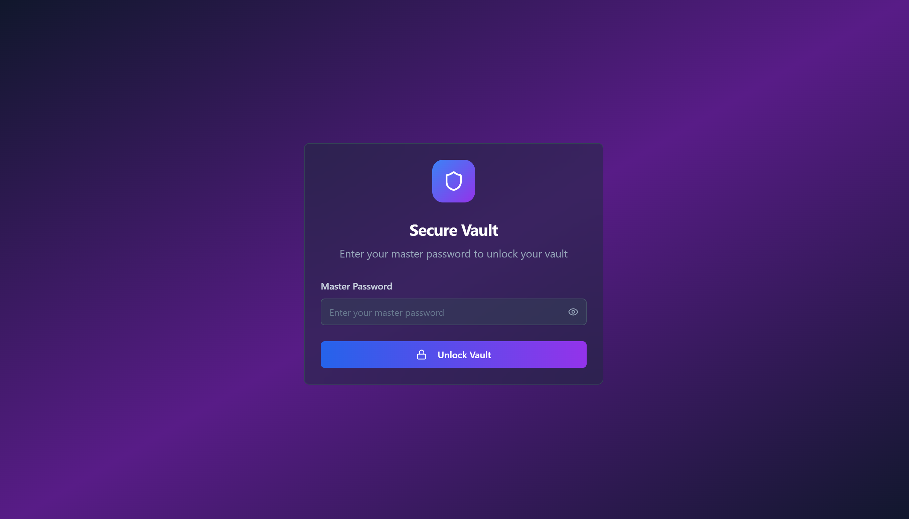
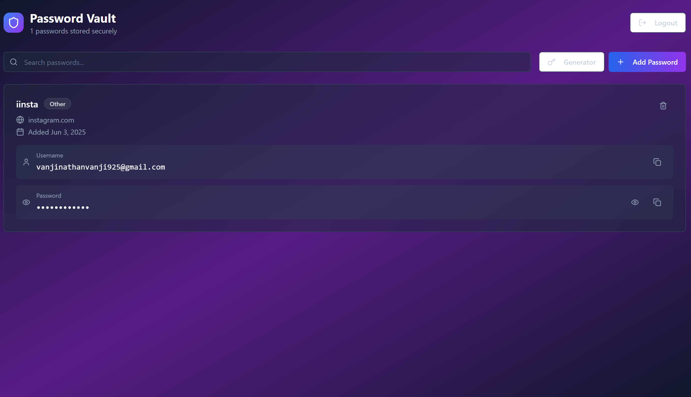
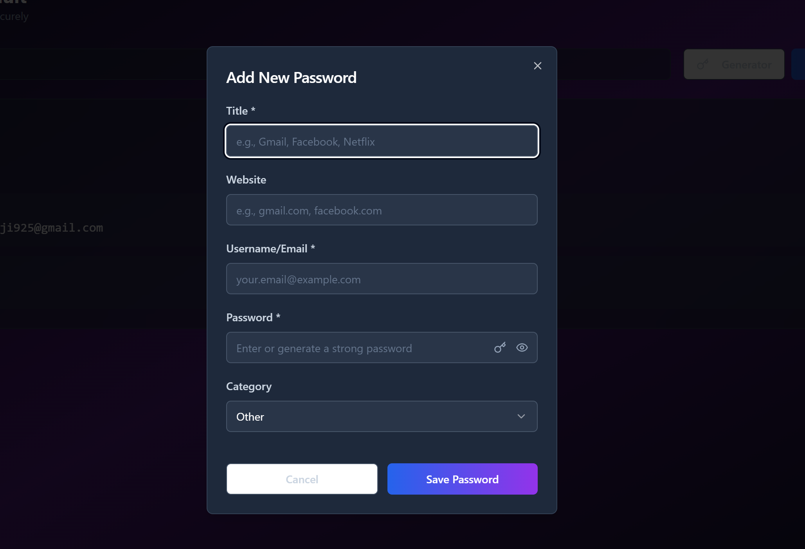
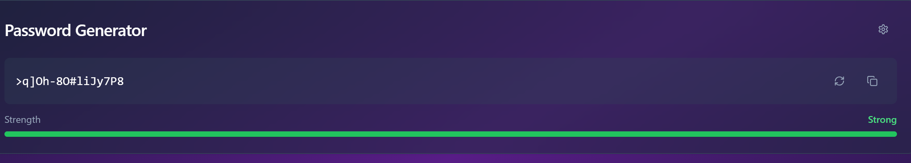

# 🚀 Welcome to My Project Dashboard

This is your project’s central hub — from development to deployment, everything you need to build and manage your app is right here.

---

## 🌐 Project Overview

**Live URL**: [project](https://lovable.dev/projects/29d131db-1ff8-4143-8d1c-2c54f0d556c0)

This link provides a live preview of your project. Any updates you make — whether through your browser or locally — will be reflected here.

---

## ✏️ How to Edit This Project

You have multiple ways to edit and enhance this project depending on your workflow preference:

---

### ✅ Option 1: Online Editor (Instant Preview)

- Access the live editor via the URL above.
- Type or prompt your desired changes.
- Edits are instantly applied and saved in the codebase.
- No installation or setup required.

---
### IMAGES

**Purpose**:  
This is the secure login screen for accessing your encrypted vault.

**Features**:
- Clean, dark-themed interface for user focus.
- A single **Master Password** input field.
- Toggle to show/hide the password for convenience.
- A prominent **Unlock Vault** button to access the vault after authentication.

---

**Purpose**:  
This is the main dashboard where users manage all their saved passwords.

**Features**:
- Search bar to filter saved entries.
- "Add Password" button for quick addition.
- Password entries display:
  - Title & category
  - Website name and link
  - Username/email
  - Password field (hidden by default) with copy and reveal options.
- Logout button on the top-right.

---

**Purpose**:  
Used to securely store a new password into the vault.

**Form Fields**:
- **Title** – For identification (e.g., Gmail, Facebook).
- **Website** – Optional field (e.g., facebook.com).
- **Username/Email** – Required field.
- **Password** – Required field with a password generator toggle and visibility toggle.
- **Category** – Dropdown to organize entries.
- Buttons for **Cancel** and **Save Password**.

---

**Purpose**:  
This feature generates strong, random passwords for secure account creation.

**Features**:
- Displays a randomly generated password.
- Options to copy or regenerate password.
- **Strength bar** indicating the complexity and security level.

---
## ✅ Summary

The Secure Vault UI ensures a seamless and secure experience for managing passwords. With clear forms, visibility toggles, and built-in password generation, it prioritizes both usability and security.
